# Multiplication_table
Bash script for  generating a multiplication table.

> SCRIPT FLOW

A script file named "multiplication_table.sh" was created using command `touch multiplication_table.sh`

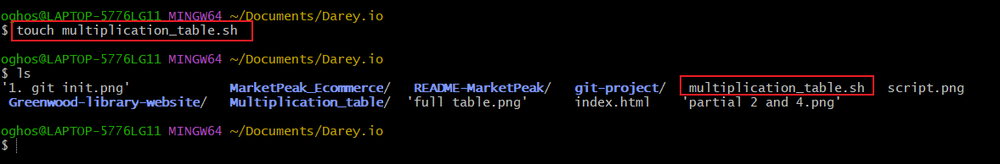

1. A Shebang line was added to the very top of the script.

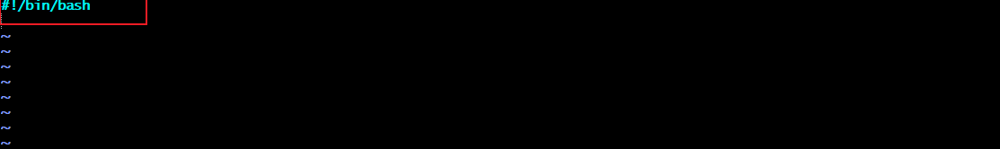

2. Add a script prompting the user to enter a number for which the multiplication table will be generated.

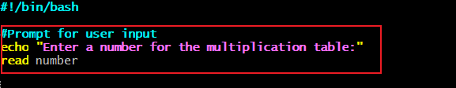

3. Ask the user if they want a full table (1 to 10) or a partial table.

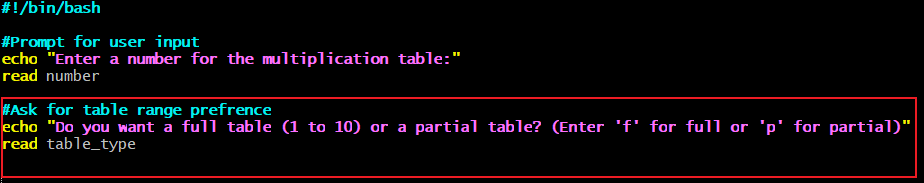

4. Use conditional logic to handle the user's choice.

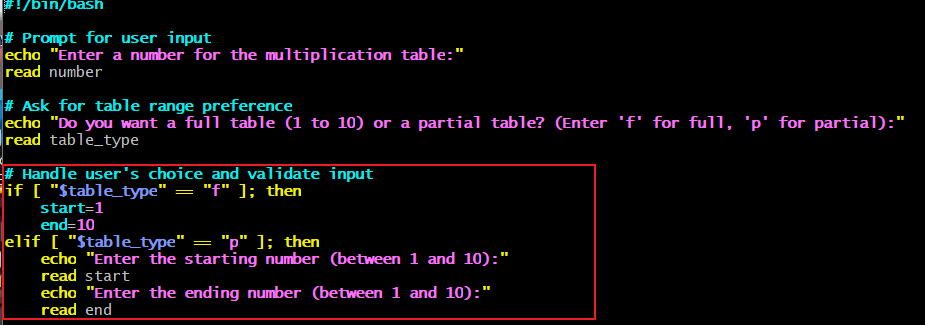

5. validate the range, invalide range will prompt the full table to show.

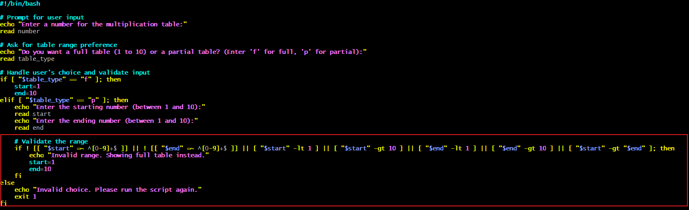

6. Ensure the user inputs valid numbers.

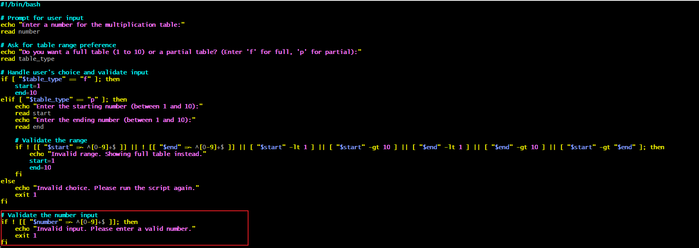

7a. Add a list form loop to generate the multiplication table based on the user's input.

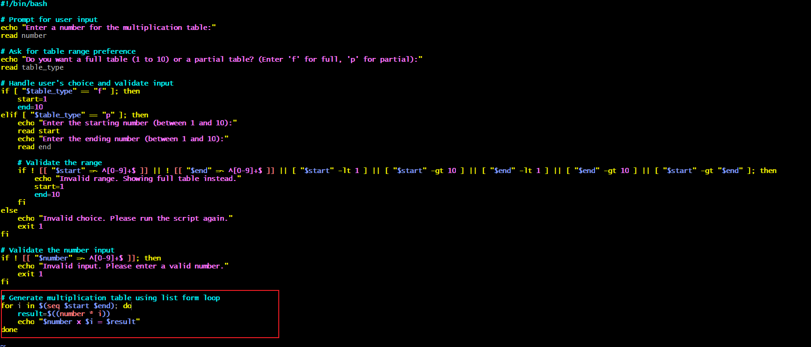

7b. Add a C-style for loop to generate the multiplication table based on the user's input.

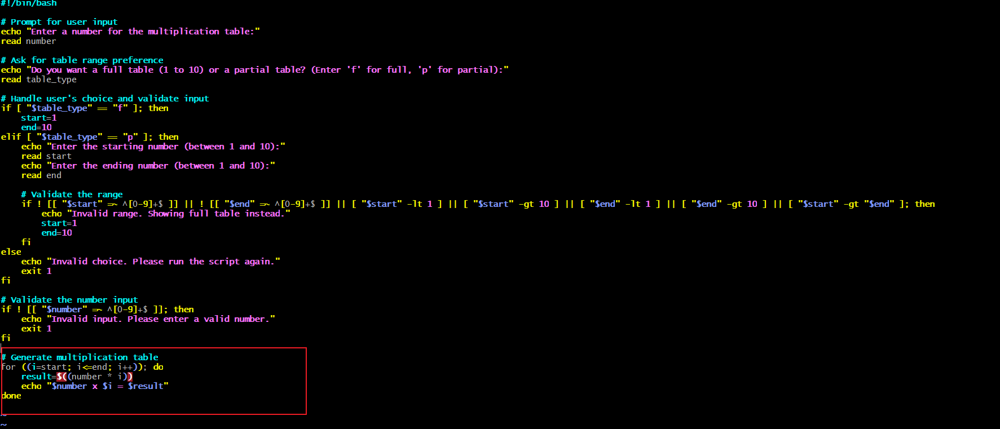

>Differnce between list form for loop and C-style for loop.

C-style for loop allows you to be abale to define the start, condition and increment in one line, while list form for loop is clearer to read.

>Execution

To execute this script command `chmod +x multiplication_table.sh
./multiplication_table.sh` will be used in terminal.

>Output

**Full multiplication table**

Showing full multiplication table of 4 from range 1-10

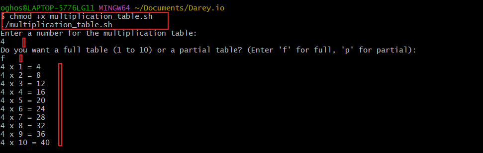

**Partial multiplication table**

Showing partial multiplication table of 4 from range 3-6

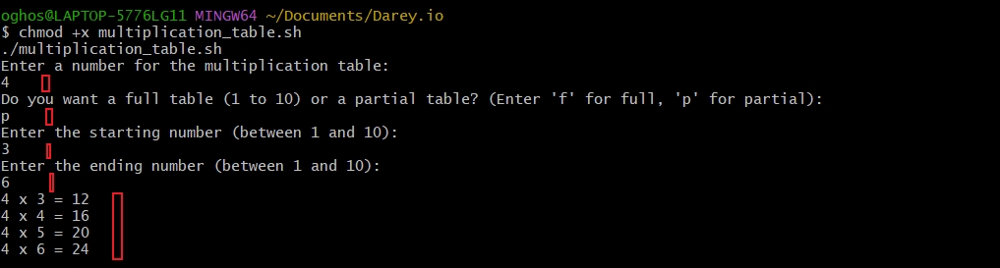

**Invalid range**

Showing partial multiplication table of 4 from range 8-3, because this was an invalid range the full muliplication table of 4 is displayed.

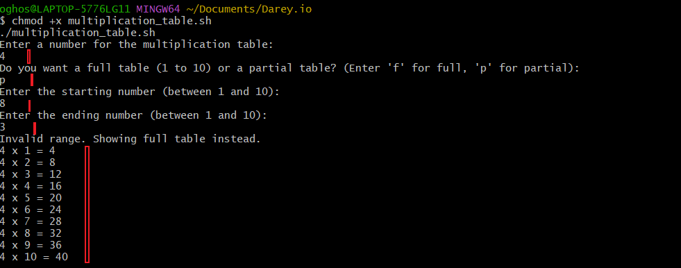

